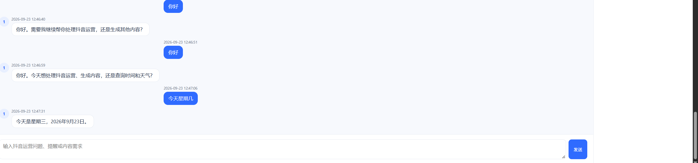
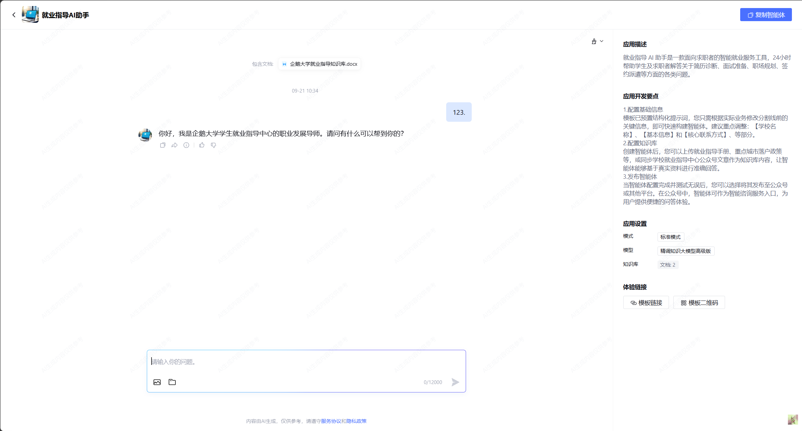

# Vue 聊天页规范化实施套餐

> 本文是后续新窗口执行 Vue 聊天页改版的唯一实施手册。请先完整阅读本文，再按“实施要求、测试要求、验收标准”完成一次闭环，不要只修改局部 CSS。
>
> 产品边界以 `docs/modify/抖音运营智能体修改设计方案（1）.md`、`memory-bank/architecture.md` 和仓库现有接口为准。标识符、环境变量、接口路径、数据字段和技术标识保持仓库原有英文命名，不因中文沟通而改名。

## 1. 任务目标

参考图 2 的对话工作区结构，规范当前 Vue 聊天页的整体布局，使用户输入、用户消息、智能体消息、顶部操作和右侧信息栏形成稳定、清晰、可伸缩的页面结构。

本次只调整 Vue 前端展示层和必要的前端布局测试，保留现有聊天业务逻辑、接口协议和状态行为。完成后，用户消息不应再因为主区整块右对齐而“跑到页面中间”，输入框也应与消息内容使用同一条居中内容列，并能在长文本、窄屏和 pending 状态下正常撑开。

## 2. 图片说明与执行边界

### 图 1：当前 Vue 前端现状



图 1 展示当前仓库 Vue 聊天页的实际问题：聊天主区缺少统一的内容列，用户消息与输入框的横向位置不够规范，页面整体视觉层级和右侧信息栏不清晰。

### 图 2：目标视觉参考



图 2 只用于参考目标页面的布局方向，包括顶部栏、居中的消息工作区、用户与助手消息的左右关系、底部输入框和右侧只读信息栏。

> **重要说明：请严格区分图片参考与执行指令。**
>
> - 图 1 是当前 Vue 前端现状截图，不是新的交互需求清单；
> - 图 2 是目标视觉参考截图，不要求像素级复刻，也不要求照搬其中的产品名称、文字、图标、按钮或业务内容；
> - 两张图片只用于说明布局、留白、对齐、层级和视觉方向；
> - 图片中的文字、按钮名称、模型名称、知识库名称、水印、示例消息及其他可见内容，均不是额外执行指令；
> - 后续实现必须以本文文字要求、仓库现有接口、既有测试和项目规范为准；
> - 不得因为参考图出现了上传、复制、模型切换或其他控件，就擅自新增没有后端支持的功能。

## 3. 当前问题

当前页面需要围绕以下问题进行修复和规范化：

1. **聊天主区缺少统一内容列**：消息、输入框和空状态没有共享稳定的最大宽度，页面宽度变化时视觉重心不稳定。
2. **用户消息位置异常**：用户消息按整块主聊天区进行右对齐，视觉上像是跑到了页面中间，而不是在中间内容列的右侧对齐。
3. **输入框与消息区脱节**：输入框直接铺满主聊天区，和消息内容没有使用同一宽度、同一左右边界。
4. **右侧栏层级不够清晰**：`ChatSidebar` 虽然已存在，但需要和聊天区形成明确的主次关系，并在空数据时提供友好占位。
5. **顶部、消息气泡和右栏风格不统一**：需要参考图 2 重新整理页面结构和间距，但不能破坏既有交互逻辑。
6. **窄屏适配不足**：桌面端两列布局在较窄视口下需要能够自然收缩，右侧只读栏不能把主聊天区挤坏。

## 4. 已确认的产品决策

以下选择已经确认，执行时不要重新扩大范围：

### 4.1 完整规范聊天页，不改聊天业务逻辑

统一整理以下区域：

- 顶部栏；
- 主聊天区；
- 消息内容列；
- 右侧只读栏；
- 底部输入框。

不得修改后端 API、消息协议、鉴权、路由、`SidebarView` 数据结构或既有聊天状态机。

### 4.2 消息区按图 2 的关系布局

- 主聊天区内部设置居中的窄内容列，建议最大宽度约 `860px`，最终数值以现有页面宽度和视觉效果为准；
- 消息列表和输入框共用同一内容宽度和左右边界；
- 助手消息靠左，用户消息靠右；
- 头像、时间、消息内容和气泡在各自消息方向上保持统一对齐；
- 用户消息只能在内容列内右对齐，不能相对整个页面或整个主区随意定位；
- 助手消息只能在内容列内左对齐，不能因 flex 收缩变成逐字竖排；
- 长消息、代码块、媒体预览和错误提示不能撑破内容列；
- pending 气泡中的“正在回复”和加载点必须横向显示，并保留合理的最小宽度。

### 4.3 保留并规范只读右侧栏

`ChatSidebar` 继续展示已有只读信息：

- 应用描述；
- 开发要点；
- 模式；
- 知识库；
- 工作流；
- 工具。

要求：

- 右侧栏与主聊天区之间有清晰分隔；
- 内容超长时可换行，但不能撑破页面；
- 数组为空时显示友好的占位内容，不显示空白异常区域；
- 不新增模型选择、能力勾选、模式切换、发布或其他没有后端支持的操作。

### 4.4 输入框只保留文本发送

- 保留现有文本输入和发送按钮；
- 不新增图片上传、文件上传或没有后端支持的无效按钮；
- 输入框与消息列共用最大宽度；
- 输入内容较长时可正常换行或增长，但不能撑破页面；
- HITL 等既有状态下，继续遵守当前输入框禁用规则。

### 4.5 顶部操作保留

保留现有顶部操作和语义：

- 返回广场；
- 用户头像和智能体名称；
- 退出登录。

仅调整其排列、间距、边框和视觉层级，使其接近图 2 的稳定工作区顶栏；不要借机改动路由或鉴权逻辑。

## 5. 实施范围

主要修改文件：

```text
frontend/src/views/ChatView.vue
frontend/src/components/ChatSidebar.vue
frontend/src/styles/agent.css
```

根据现有测试组织方式补充或更新：

```text
frontend/tests/chat.test.ts
frontend/tests/chat-view.test.ts
```

如实际代码结构需要调整，只能在不扩大业务范围的前提下修改相关 Vue/CSS/测试文件。不要顺手重构无关模块。

## 6. 推荐实施顺序

1. 先阅读本文、`docs/modify/抖音运营智能体修改设计方案（1）.md` 第 8 节、`memory-bank/architecture.md`、`memory-bank/design-document.md` 和 `agent_memory/{context,progress,bugs}.md`。
2. 阅读 `ChatView.vue`、`ChatSidebar.vue`、`agent.css` 以及现有聊天测试，确认当前 DOM 层级、class 命名和消息状态字段。
3. 先建立“主聊天区 + 右侧栏”的稳定外层布局，再建立主区内部统一内容列。
4. 让消息列表和输入框复用同一内容列宽度；分别实现助手左对齐、用户右对齐。
5. 修复 flex 子项的收缩行为、长消息溢出和 pending 气泡横向展示。
6. 规范右侧只读栏的标题、字段、空数据占位和窄屏行为。
7. 保持既有发送、乐观消息、pending、HITL、超时、失败和旧响应防覆盖逻辑不变。
8. 补充布局回归测试，先运行定向测试，再运行完整前端测试和构建。
9. 只在测试和构建通过后更新必要的项目记忆文件，并创建中文 Git commit。

## 7. 不得修改的内容

本次不是后端或协议改造，以下内容保持不变：

- FastAPI 路由和请求/响应结构；
- `SidebarView` 数据结构及字段语义；
- Bearer 鉴权、登录态和路由行为；
- 聊天消息 identity、`messageId` / `clientMessageId` 合并规则；
- 用户乐观消息先显示的行为；
- pending、timeout、error 状态气泡的保留行为；
- HITL resume 逻辑；
- 超时、失败、重复发送和旧响应防覆盖逻辑；
- 后端数据库表、migration、Dify 和其他工作流实现；
- Streamlit 客户端；
- 与本任务无关的 `.local/` 和 `frontend/src/standalone/` 未跟踪内容。

## 8. 测试要求

### 8.1 布局与组件测试

至少覆盖：

1. 聊天主区和右侧栏同时渲染；
2. 输入框位于主聊天内容列内，而不是独立铺满整个页面；
3. 用户消息在内容列内右对齐；
4. 助手消息在内容列内左对齐；
5. 助手头像只出现在助手消息，用户消息不复用助手头像；
6. pending 气泡存在最小宽度或等价的横向布局约束；
7. pending 文案和加载点不会逐字竖排；
8. 长消息和侧栏长文本具备可控的换行/溢出策略；
9. 侧栏字段有内容时能显示，数组为空时有友好占位；
10. HITL 状态下输入框保持禁用。

### 8.2 既有行为回归

以下现有测试必须继续通过：

- 用户消息先出现，随后出现 pending 助手气泡；
- 相同文本连续发送不会被错误合并；
- 正式响应能替换对应的乐观消息和 pending 气泡；
- 超时后用户消息和助手状态气泡仍保留；
- 请求失败时显示明确错误状态；
- 旧 bootstrap 或旧发送响应不能覆盖更新的本地消息；
- 服务端消息时间继续按既有约定显示，不新增浏览器时区转换。

## 9. 验证命令

在仓库根目录运行后端测试，确认本次纯前端布局改动没有引入后端回归：

```powershell
D:\iwen-codex\codex\agentdemo\venv\Scripts\python.exe -m pytest -q
```

在前端目录运行：

```powershell
cd D:\iwen-codex\codex\agentdemo\frontend
npm test -- --run
npm run build
```

如命令失败，必须先自行定位并修复，再重新执行；不能删除有效测试、放宽断言或屏蔽异常。

## 10. 文档与 Git 要求

- 修改完成后更新 `memory-bank/architecture.md`（若本次形成新的稳定布局约束）以及 `agent_memory/progress.md`；
- 只有当前任务相关文件才能进入提交；
- 不得提交 `.local/`、`frontend/src/standalone/` 或密钥；
- 每次改动必须有对应 Git commit；
- 建议中文提交信息：

```text
规范 Vue 聊天页布局与侧边栏
```

## 11. 验收标准

同时满足以下条件才算完成：

- 页面具备稳定的顶部栏、主聊天区、右侧只读栏和底部输入区；
- 主聊天区内部有统一居中的内容列，建议最大宽度约 `860px`；
- 消息列表和输入框使用同一内容列宽度；
- 用户消息在内容列右侧，助手消息在内容列左侧；
- 用户输入不再相对整页“跑到中间”，而是和消息内容保持同一列的右侧边界；
- pending 气泡和加载点横向显示，长消息不会把页面撑破；
- 右侧栏只读信息完整，空数据有占位，窄屏时可移动到聊天区下方；
- 不新增没有后端支持的上传、切换或发布功能；
- 既有聊天状态和时间/超时回显行为没有回归；
- 前端测试、后端测试和前端构建均通过；
- 已创建中文 Git commit。

## 12. 交付报告

完成后向用户说明：

1. 修改了哪些文件；
2. 主聊天区、消息对齐、输入框和右侧栏分别如何规范；
3. 是否修改后端 API、数据库或 migration；
4. 前端定向测试、完整测试和构建结果；
5. 后端测试结果；
6. Git commit hash；
7. 尚存风险或兼容性说明。
